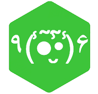

<!-- 
MIT License

Copyright (c) 2021 Othneil Drew

Permission is hereby granted, free of charge, to any person obtaining a copy
of this software and associated documentation files (the "Software"), to deal
in the Software without restriction, including without limitation the rights
to use, copy, modify, merge, publish, distribute, sublicense, and/or sell
copies of the Software, and to permit persons to whom the Software is
furnished to do so, subject to the following conditions:

The above copyright notice and this permission notice shall be included in all
copies or substantial portions of the Software.

THE SOFTWARE IS PROVIDED "AS IS", WITHOUT WARRANTY OF ANY KIND, EXPRESS OR
IMPLIED, INCLUDING BUT NOT LIMITED TO THE WARRANTIES OF MERCHANTABILITY,
FITNESS FOR A PARTICULAR PURPOSE AND NONINFRINGEMENT. IN NO EVENT SHALL THE
AUTHORS OR COPYRIGHT HOLDERS BE LIABLE FOR ANY CLAIM, DAMAGES OR OTHER
LIABILITY, WHETHER IN AN ACTION OF CONTRACT, TORT OR OTHERWISE, ARISING FROM,
OUT OF OR IN CONNECTION WITH THE SOFTWARE OR THE USE OR OTHER DEALINGS IN THE
SOFTWARE. -->

[Original Best-README-Template](https://github.com/othneildrew/Best-README-Template)

---

[![Contributors][contributors-shield]][contributors-url]
[![Forks][forks-shield]][forks-url]
[![Stargazers][stars-shield]][stars-url]
[![Issues][issues-shield]][issues-url]
[![MIT License][license-shield]][license-url]

<!-- PROJECT LOGO -->
 

  

<h1 align="center">ARG Lang</h1>

  

    Augmented RG style code language - fast, compact, inefficient (probably)
     
    <a href="https://github.com/RosscoG/ARG"><strong>Explore the docs »</strong></a>
     
     
    <a href="https://github.com/RosscoG/ARG">View Demo</a>
    ·
    <a href="https://github.com/RosscoG/ARG/issues">Report Bug</a>
    ·
    <a href="https://github.com/RosscoG/ARG/issues">Request Feature</a>
  

<!-- TABLE OF CONTENTS -->

  
Table of Contents

  <ol>
    <li>
      <a href="#about-the-project">About The Project</a>
      <ul>
        <li><a href="#built-with">Built With</a></li>
      </ul>
    </li>
    <li>
      <a href="#getting-started">Getting Started</a>
      <ul>
        <li><a href="#prerequisites">Prerequisites</a></li>
        <li><a href="#installation">Installation</a></li>
      </ul>
    </li>
    <li><a href="#usage">Usage</a></li>
    <li><a href="#roadmap">Roadmap</a></li>
    <li><a href="#contributing">Contributing</a></li>
    <li><a href="#license">License</a></li>
    <li><a href="#contact">Contact</a></li>
    <li><a href="#acknowledgments">Acknowledgments</a></li>
  </ol>

## About The Project
ARG is a simple programming language with heavy emphasis on compact and symbolic code.  The primary goal is to refresh and update knowledge of various languages and systems design during the development.  If it turns into a useful tool as a quick calculator, all the better.  

(<a href="#readme-top">back to top</a>)

## Getting Started
**TODO**

### Prerequisites
**TODO**

### Installation
Minimal/None  
**TODO**

(<a href="#readme-top">back to top</a>)

## Usage
The idea ultimately would be to throw code from file or terminal at it for an instant response.  

(<a href="#readme-top">back to top</a>)

## Roadmap

1. [ ] Simple 4 banger
1. [ ] Flow control
1. [ ] 

See the [open issues](https://github.com/RosscoG/ARG/issues) for a full list of proposed features (and known issues).

(<a href="#readme-top">back to top</a>)

## Contributing
As this is a personal learning tool/project for now contributions would be tricky to manage. Will see once I get it to some sort of usefulness.

<!-- Contributions are what make the open source community such an amazing place to learn, inspire, and create. Any contributions you make are **greatly appreciated**. -->

That being said:  
If you have a suggestion that would make this better, please fork the repo and create a pull request. You can also simply open an issue with the tag "enhancement".
Don't forget to give the project a star! Thanks again!

1. Fork the Project
2. Create your Feature Branch (`git checkout -b feature/AmazingFeature`)
3. Commit your Changes (`git commit -m 'Add some AmazingFeature'`)
4. Push to the Branch (`git push origin feature/AmazingFeature`)
5. Open a Pull Request

(<a href="#readme-top">back to top</a>)

## License

Distributed under the MIT License. See [LICENSE](/LICENSE) for more information.

(<a href="#readme-top">back to top</a>)

## Contact

Project Link: [https://github.com/RosscoG/ARG](https://github.com/RosscoG/ARG)

(<a href="#readme-top">back to top</a>)

## Acknowledgments

* 
* 
* 

(<a href="#readme-top">back to top</a>)

<!-- MARKDOWN LINKS & IMAGES -->
<!-- https://www.markdownguide.org/basic-syntax/#reference-style-links -->
[contributors-shield]: https://img.shields.io/github/contributors/RosscoG/ARG.svg?style=for-the-badge
[contributors-url]: https://github.com/RosscoG/ARG/graphs/contributors
[forks-shield]: https://img.shields.io/github/forks/RosscoG/ARG.svg?style=for-the-badge
[forks-url]: https://github.com/RosscoG/ARG/network/members
[stars-shield]: https://img.shields.io/github/stars/RosscoG/ARG.svg?style=for-the-badge
[stars-url]: https://github.com/RosscoG/ARG/stargazers
[issues-shield]: https://img.shields.io/github/issues/RosscoG/ARG.svg?style=for-the-badge
[issues-url]: https://github.com/RosscoG/ARG/issues
[license-shield]: https://img.shields.io/github/license/RosscoG/ARG.svg?style=for-the-badge
[license-url]: https://github.com/RosscoG/ARG/blob/master/LICENSE.txt
